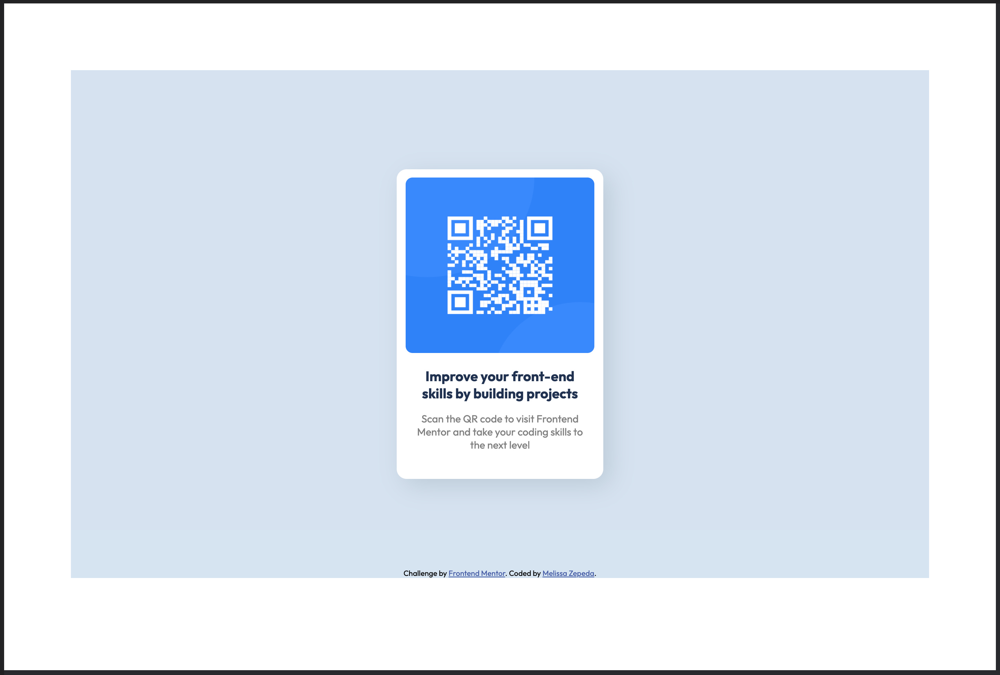

# Frontend Mentor - QR code component solution

This is a solution to the [QR code component challenge on Frontend Mentor](https://www.frontendmentor.io/challenges/qr-code-component-iux_sIO_H). Frontend Mentor challenges help you improve your coding skills by building realistic projects. 

## Table of contents

- [Overview](#overview)
  - [Screenshot](#screenshot)
  - [Links](#links)
- [My process & What I learned](#my-process)
  - [Built with](#built-with)
  - [Continued development](#continued-development)
  - [Useful resources](#useful-resources)
- [Author](#author)

## Overview

### Screenshot

### Links

- Solution URL: [Github](https://github.com/melissazpd/qr-code-component-main)
- Live Site URL: [Vercel: Live Site](https://qr-code-component-main-nine.vercel.app/)

## My process & What I learned

I started by building the iteams in HTML, even if it looked cluncky and ugly, I tried to get the foundation before moving on to CSS

Then I started to play with the visual aspects of the QR code, where I found out that using pixels wasn't the solution I wanted to use. I felt that it doesn't make the transition from desktop to mobile seamless. I found some resources that helped me learn about viewport units to implement them into my code. 

### Built with

- Semantic HTML5 markup
- CSS custom properties
- Included Viewport units

### Continued development

I still feel like my code does not have a good flow when transitioning into different sized screens. I would love to continue practicing and finding the best way to make it more seamless.

I'm also looking to see what the best practice is when using units. Is it best practice for me to use all viewport? Is it ok for me to mix and match?

### Useful resources

- [CSS Tricks: A Complete Guide to CSS Media Queries](https://css-tricks.com/a-complete-guide-to-css-media-queries/) - This helped me refresh my knowledge of media queries with CSS.
- [CSS Tricks: Fun Viewport Units](https://css-tricks.com/fun-viewport-units/) - This is an amazing article that helped me understand what view port units are and how they work by resizing an item based on the size of the screen.

## Author

- Website - [Melissa](https://melissazpd.com/)
- Frontend Mentor - [@melissazpd](https://www.frontendmentor.io/profile/melissazpd)
- Twitter - [@_melissazpd](https://twitter.com/_melissazpd)

